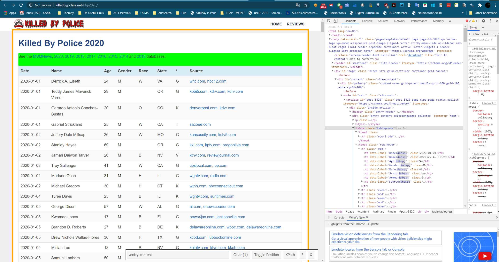

```{r setup, include=FALSE}
knitr::opts_chunk$set(echo = TRUE)
```

# Goal
I want to be able to analyse the data on police shootings from 2013-2020 (july 2020) that are nicely collated on summarised on https://killedbypolice.net/.

# Challenge
The data resides in the HTML table that has notoriously messy headers and tags. Look and weep:


But fear not! There’s nothing that R can’t fix in a blink of an eye. And here’s how:

Great guidelines to finding the right tags are in [rvest tutorial on Youtube](https://www.youtube.com/watch?v=4IYfYx4yoAI)


# Solution
First, load a handful of classic R packages:

{rvest} for web-scraping
{dplyr} for data-wrangling
{tidyr} for data transformation
{stringr} for string manipulation
{janitor} for clean headers that your OCD will love you for


```{r libraries}
library(rvest)
library(dplyr)
library(tidyr)
library(stringr)
library(janitor)
```


## Scrape the data

Next, learn how scrape the content of the website and extract the HTML table:
```{r}
url <- "https://killedbypolice.net/kbp2020"
# scrape the website
url_html <- read_html(url)


# Option 1 extract the HTML table individual row tags <tr> >> BUT this straightjackets each row into an element in a character vector, which would require extra cleaning
whole_table <- url_html %>% 
 html_nodes("tr") %>%
 html_text(trim = FALSE) 

#2 extract the HTML table individual datapoint tags <td>  >> BUT this creates a character element out of each table cell, which would require extra cleaning
whole_table <- url_html %>% 
 html_nodes("td") %>%
 html_text(trim = FALSE) 

# extract the HTML table through the <table> tag >> this creates a list instead of dataframe, but we can unlist a list and coerce it into a dataframe, so vaersgo!
whole_table <- url_html %>% 
 html_nodes("table") %>%
 html_table()  #str(whole_table) turns out to be a list

new_table <- do.call(cbind,unlist(whole_table, recursive = FALSE)) # we unlist and combine the individual elements as columns, following https://stackoverflow.com/questions/16300344/how-to-flatten-a-list-of-lists
head(new_table) # ok, looks good, too bad it took 2 hours


# https://stackoverflow.com/questions/4227223/convert-a-list-to-a-data-frame
```

## Automate the scraping!

Now, lets write a function to read the tables for all the sequential websites
```{r}

# First create the function to scrape tables

scrape_police_death <- function(website){
	url <- read_html(website)
	annual_table <- url %>% 
 			html_nodes("table") %>%
 			html_table()  #str(whole_table) turns out to be a list
  annual_table <- do.call(cbind,unlist(annual_table, recursive = FALSE))
 }

# Test that the function works

table2018 <- scrape_police_death("https://killedbypolice.net/kbp2018")


# Now write a loop to apply it to sequential years from 2018 on

mastertable=NULL  # we need to create an empty container for results

for (year in 2013:2020){  # here we create a loop to iterate over the years
	print(year)
	url <- "https://killedbypolice.net/kbp"
	website <- paste0(url,year)  # here we bind the year to the website
	annual_table <- scrape_police_death(website) # here we apply the function
	mastertable <- rbind(mastertable, annual_table) # we add the results from the given year to our master dataset
	}
head(mastertable,2)
tail(mastertable)

# scrape the website
url_html <- read_html(url)

```

## Revert from factor


```{r}
data <- data %>% 
	select(-Date) %>% 
	mutate(age = as.numeric(Age), source = as.character(Source)) %>% 
	select(-c(Source, Age)) %>% 
	rename(Age=age,Source=source, Method="*")
	
	

	
```

## Cleanup the dates with lubridate package and grepl()

First, lets look how well structured our Date column is

```{r}

mastertable$Date[c(70:80, 160:170)]
```


```{r}
library(lubridate)

data <- as_tibble(mastertable)
data <- data %>% 
	mutate(NewDate =
			case_when(
				grepl("201[34]",Date) ~ mdy(Date),
				!grepl("201[34]",Date)~ ymd(Date)))
				
data <- data %>% 
	mutate(Year = year(NewDate) )

tail(data$Year)
class(data$NewDate)
length(which(is.na(data$NewDate)))
```


## Analyze!

str(data)
```{r}
library(ggplot2)
library(ggridges)


data %>% 
  filter(Gender %in% c("F", "M", "T")) %>% 
  filter(!is.na(Year)) %>% 
  ggplot(aes(x = Age,
             y = factor(Year),
             fill = Gender)) +
  geom_density_ridges(alpha = 0.5, 
                      scale = 0.9)  +
  theme_ridges(font_size = 10) +
  scale_x_continuous(breaks = seq(0, 100, 10),
                     labels = seq(0, 100, 10)) +
  xlab("Age at death (years)") +
  ylab("Year") +
  theme(axis.title = element_text(size = 14))
```


Of the three ethnic groups that make up most of the deaths, Black and Latino people tend to be younger than White people when they are killed by police. 

```{r}
data %>% 
  filter(Race %in% c("B", "W", "L")) %>% 
  filter(!is.na(Year)) %>% 
  ggplot(aes(x = Age,
             y = factor(Year),
             fill = Race)) +
  geom_density_ridges(alpha = 0.6, 
                      scale = 0.9)  +
  theme_ridges(font_size = 10) +
  scale_x_continuous(breaks = seq(0, 100, 10),
                     labels = seq(0, 100, 10)) +
  xlab("Age at death (years)") +
  ylab("Year") +
  theme(axis.title = element_text(size = 14))
```

By far the most common way that people are killed by police is with a gun. Deaths by vehicle involve women more often than men. 

```{r}
data %>% 
  filter(!is.na(Year)) %>% 
  filter(Method != "NA") %>% 
  filter(Gender %in% c("M", "F", NA)) %>% 
  group_by(Year, 
           Gender,
           Method) %>% 
  tally() %>% 
  mutate(perc = n / sum(n) * 100)  %>% 
  ggplot(aes(Method,
             perc,
             fill = Gender)) +
  geom_col() +
  facet_grid(Gender~Year) +
  theme_minimal(base_size = 10) +
  xlab("Method of killing") +
  ylab("Percentage of all\npeople killed by police\nby gender") 
```


## Map casualties by state

In 2016, the state with the largest number of people killed by police was California.


```{r}
#install.packages(c("statebins", "viridis"))
library(statebins) # using GitHub version
library(viridis)

# we need to convert state abbreviations to state names for the statebins function
state_abb <- data_frame(state_name = state.name,
                        state_abb = state.abb)

# we need to add the state popluations so we can get a proportion of people in each state
# we got this from https://www2.census.gov/programs-surveys/popest/tables/2010-2016/state/totals/nst-est2016-01.xlsx
state_populations <- readr::read_csv("data-raw/nst-est2016-01.csv")

# clean it a little
state_populations <-  
  state_populations %>% 
  mutate(state_name = gsub("\\.", "", X__1)) %>%
  left_join(state_abb)

# compute deaths by state and as deaths per 1000 people in each state
by_state <- data %>% 
  filter(Year == 2016) %>% 
  group_by(State) %>% 
  tally() %>% 
  left_join(state_abb, by = c('State' = 'state_abb')) %>% 
  filter(!is.na(state_name)) %>% 
  left_join(state_populations) %>% 
  mutate(per_n_people = (n / `2016`) * 1000000)

# plot 'statebin' style map
ggplot(by_state, 
       aes(state = state_name, 
           fill = n)) +
  geom_statebins() +
  coord_equal() +
  scale_fill_viridis() +
  theme_statebins() +
  labs(title = "Total number of people killed by police in each state in 2016") +
  theme(legend.title=element_blank()) 
```


The difference between 2016 and 2019 is hardly visible, with exception of Texas. Downloaded on 20 July from https://www2.census.gov/programs-surveys/popest/tables/2010-2019/state/asrh/

```{r}
state_population19 <- readr::read_csv("data-raw/sc-est2019-alldata5.csv")

# clean it a little
state_pop17_19 <- state_population19 %>% 
	group_by(NAME) %>% 
	summarize(pop2017= sum(POPESTIMATE2017), pop2018 = sum(POPESTIMATE2018), pop2019=sum(POPESTIMATE2019)) %>% 
	rename(state_name = NAME)

state_pop17_19 %>% 
	select(state_name, pop2017) %>% 
	glimpse()


# compute deaths by state and as deaths per 1000 people in each state
by_state19 <- data %>% 
  filter(Year == 2019) %>% 
  group_by(State) %>% 
  tally() %>% 
  left_join(state_abb, by = c('State' = 'state_abb')) %>% 
  filter(!is.na(state_name)) %>% 
  left_join(state_pop17_19) %>% 
  mutate(per_n_people = (n / `pop2019`) * 1000000)

# plot 'statebin' style map
ggplot(by_state19, 
       aes(state = state_name, 
           fill = n)) +
  geom_statebins() +
  coord_equal() +
  scale_fill_viridis() +
  theme_statebins() +
  labs(title = "Total number of people killed by police in each state in 2019") +
  theme(legend.title=element_blank()) 
```
```

Lets consider the differences in the number of people in each state: in 2016, New Mexico and Alaska have the highest proportions of people killed by police.  

```{r}
ggplot(by_state, 
       aes(state = state_name, 
           fill = per_n_people)) +
  geom_statebins() +
  coord_equal() +
  scale_fill_viridis() +
  theme_statebins() +
  labs(title = "Number of people killed by police in each state in 2016,\nper 1,000,000 people")  +
  theme(legend.title=element_blank()) 
```

in 2019 the primacy still goes to Alaska, but NM, OK and West Virginia follow in tight succession (while Texas stands at 1 per 100,000)

```{r}
ggplot(by_state19, 
       aes(state = state_name, 
           fill = per_n_people)) +
  geom_statebins() +
  coord_equal() +
  scale_fill_viridis() +
  theme_statebins() +
  labs(title = "Number of people killed by police in each state in 2019,\nper 1,000,000 people")  +
  theme(legend.title=element_blank()) 
```


